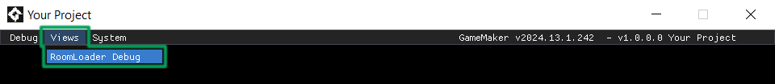
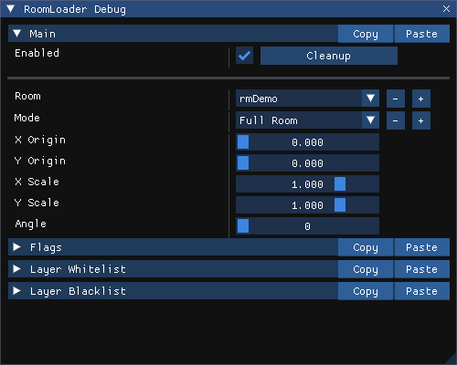
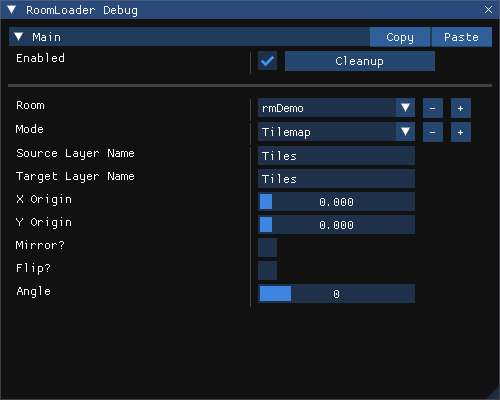

# Debug View

The Debug View module offers a quick way to test room loading using a :Debug Overlay: view, without writing any code. It allows loading any room in the project at the mouse coordinates, with fully customizable parameters.

## Setup

You can enable Debug View by setting the :ROOMLOADER_DEBUG_VIEW_ENABLED: config macro to `true`.

If :ROOMLOADER_DEBUG_VIEW_START_VISIBLE: is also set to `true`, the Debug View will appear automatically when the game starts. Otherwise, you can open the :Debug Overlay: by calling `show_debug_overlay(true);`, then navigate to the **Views** menu in the top bar and select the `RoomLoader Debug` view.

Once open, you will see this window on your screen.

Now that the :Debug View: is enabled, you can start loading rooms at the mouse coordinates by pressing :ROOMLOADER_DEBUG_VIEW_LOAD_KEY:. You can also pick which room to load and configure loading parameters, that's all described in the [Controls](#controls) section below.

## Controls

* The **Enabled** checkbox lets you control whether room loading is active when you press the designated key. If unchecked, pressing :ROOMLOADER_DEBUG_VIEW_LOAD_KEY: will not load rooms. This toggle is useful for temporarily disabling room loading, since GameMaker doesn't provide a built-in way to detect if a :Debug Overlay: view is open.
    ::: warning
    When left enabled, pressing :ROOMLOADER_DEBUG_VIEW_LOAD_KEY: will trigger loading even when the view is closed.
    :::
* The **Cleanup** button unloads any rooms that were loaded via the :Debug View:.
* The **Room** dropdown allows you to select which room to load. The list of rooms shown is determined by the :ROOMLOADER_DEBUG_VIEW_ROOMS: config macro. If this macro is set to :Undefined:, all rooms in your project will be available for selection. Otherwise, only the rooms specified in the macro will appear.
* The **Mode** dropdown allows you to select whether to load :Full Rooms:, :Instances: or :Tilemaps:. The following controls will adjust accordingly to fit the selected mode's arguments.

### Full Room

:Origin:, :Scaling:, :Rotation:, :Flags: for :Asset Type Filtering: and *Layer Whitelist* & *Blacklist* for :Layer Name Filtering:.

### Instances

*Depth*, :Origin:, :Scaling:, :Rotation:.

### Tilemap

*Source Layer Name*, *Target Layer Name* (has to exist in the current room), :Origin:, :Mirroring:, :Flipping: and :Rotation:. 

