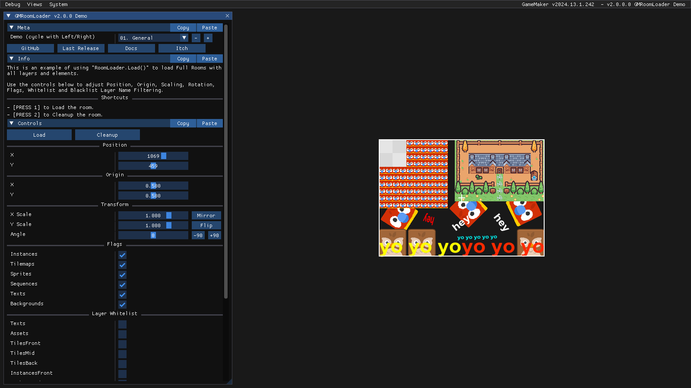
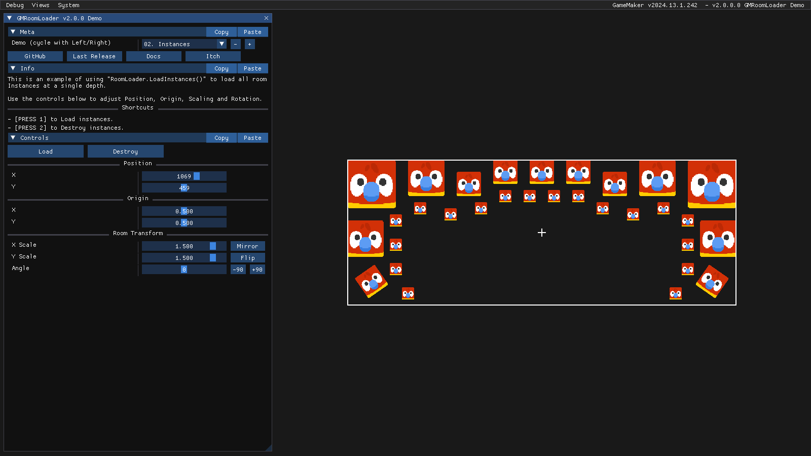
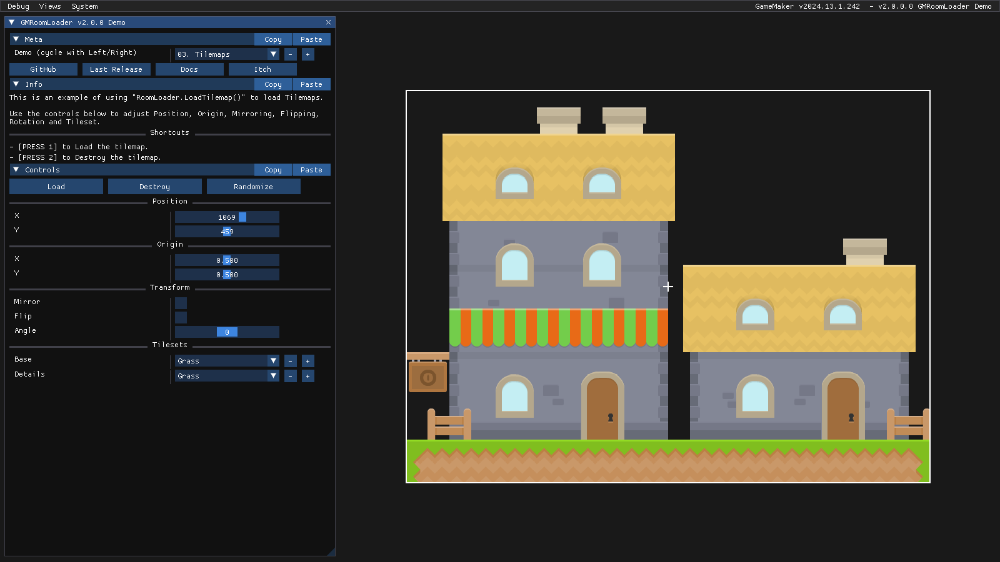
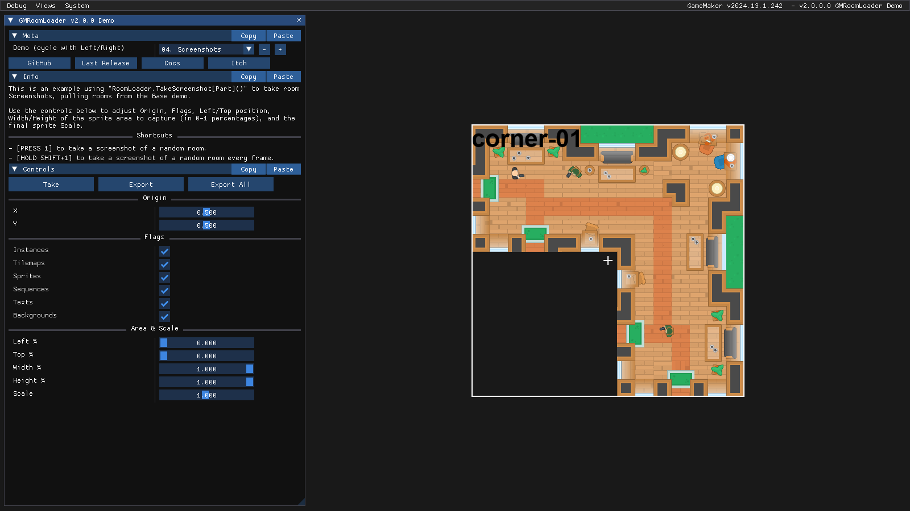
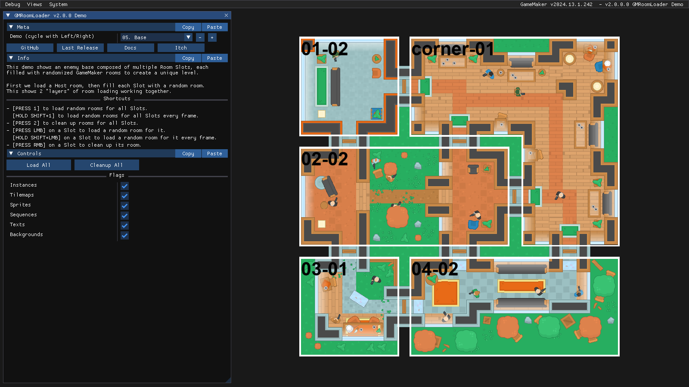

# Demos & Tutorials

<!-- 

  <iframe 
    src="https://www.youtube.com/embed/dQw4w9WgXcQ"
    frameborder="0" 
    allow="accelerometer; autoplay; clipboard-write; encrypted-media; gyroscope; picture-in-picture; web-share" 
    allowfullscreen
    style="position: absolute; top:0; left:0; width:100%; height:100%;">
  </iframe>

 -->

## First Setup

As mentioned in the [First Setup](/pages/home/gettingStarted/gettingStarted/#first-setup) section of [Getting Started](/pages/home/gettingStarted/gettingStarted), this is a simple project demonstrating how to load a room centered at the mouse coordinates when pressing 1 and unload it when pressing 2.

> ℹ️ Download the [GMRoomLoader First Setup.yyz](https://github.com/glebtsereteli/GMRoomLoader/raw/main/docs/public/GMRoomLoader%20First%20Setup.yyz) example project.

  <video style="width: 100%; height: auto;" controls>
    <source src="/pages/home/gettingStarted/firstSetup.mp4" type="video/mp4">
  </video>

## Demo Project

GMRoomLoader comes with a demo project showcasing all core features of the library. The demo includes a DBG ImGui control panel with demo cycling and custom controls for each example.

> ℹ️ Download the [GMRoomLoader Demo.yyz](https://github.com/glebtsereteli/GMRoomLoader/raw/main/docs/public/GMRoomLoader%20Demo.yyz) project. @TODO add project

---
### General

This is an example of using :RoomLoader.Load(): to load Full Rooms with all layers and elements, with controls for position, :Origin:, :Scaling:, :Rotation:, :Flags:, Whitelist and Blacklist :Layer Name Filtering:.

---
### Instances

This is an example of using :RoomLoader.LoadInstances(): to load all room Instances at a single depth, with controls for position, :Origin:, :Scaling: and :Rotation:.

---
### Tilemaps

This is an example of using :RoomLoader.LoadTilemap(): to load Tilemaps, with controls for position, :Origin:, :Mirroring:, :Flipping:, :Rotation: and :Tileset:.

---
### Screenshots

This is an example of using :Screenshotting: methods to take room screenshots, with controls for :Origin:, :Flags:, Left/Top position, Width/Height of the sprite area to capture (in 0-1 percentages), and the final sprite :Scale:.

---
### Base

This is an example of an enemy base composed of multiple "Room Slots", each filled with randomized GameMaker rooms to create a unique level. First we load a Host room, then fill each Slot with a random room. This shows 2 "layers" of room loading working together.

## Tutorials

✨ Coming Soon™ ✨