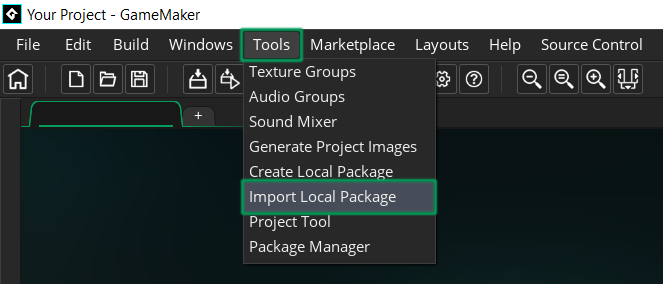
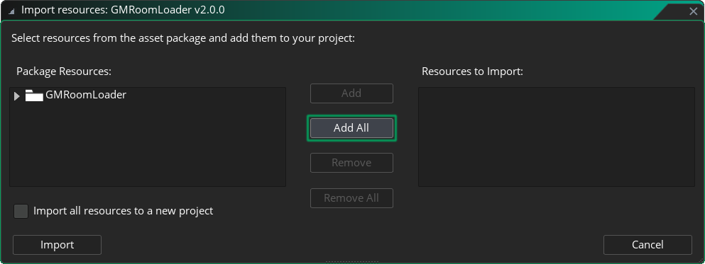
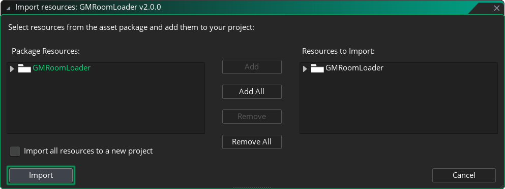

# Getting Started

This page walks you through installing and setting up GMRoomLoader in your GameMaker project for the first time.

We'll begin by importing the `.yymps` package. Then in the [First Setup](#first-setup) section, we'll go through core library operations with [Initialization](#_1-initialize), [Loading](#_2-load), and [Cleanup](#_3-clean-up). By the end, you'll have a simple working example that lets you load and unload rooms in real time.

## Requirements

* [GameMaker](https://gamemaker.io/en/download) version `IDE v2024.13.1.193` and `Runtime v2024.13.1.242` or above.
* Basic familiarity with GameMaker and GML, including:
    * Asset types (rooms, objects, scripts, sprites, tilemaps, etc).
    * Working with objects and events.
    * Structs, functions/methods and arguments, macros and enums.

## Installation
1. Download the `GMRoomLoader v2.3.0.yymps` package from the latest [Release](https://github.com/glebtsereteli/GMRoomLoader/releases/v2.3.0).
2. Import the package into your project.
    * Navigate to __Tools__ in the top toolbar and click __Import Local Package__, or just drag and drop the file into GameMaker.
    
    * Locate and select the `GMRoomLoader v2.3.0.yymps` local package in Explorer/Finder.
    * Click __Add All__.
    
    * Click __Import__.
    
        > The whole library lives inside the `GMRoomLoader` folder, and the only file under `Included Files` is the [MIT license](/pages/home/faq/#📍-how-is-gmroomloader-licensed-can-i-use-it-in-commercial-projects).
3. You're good to go! Next, check out the [First Setup](#first-setup) section below to load your first room.

:::tip UPDATING
If you already have GMRoomLoader installed and want to update to the latest version, check the [Updating](/pages/home/faq/#updating) FAQ entry for instructions.
:::
## First Setup
While GMRoomLoader offers many tools for handling room data, loading rooms and working with created elements, the following :Initialization:, :Loading: and :Cleanup: methods are the only basics you need to get things working and load your first room!

We'll go over each step first and then bring them all together in a simple complete example.

### 1. Initialize
[Initialize](/pages/api/roomLoader/data/#initialization) the data for the room you want to load.
```js
RoomLoader.DataInit(rmExample);
```
It's best to do this at the very start of your game in some "initialization" or "master" manager object. For this simple example, feel free to do it in the Create event of the object you'd like to handle your room loading.

::: tip ℹ️ THIS IS OPTIONAL
Starting with `v2.3.0`, data initialization is optional and happens automatically. Skipping explicit initialization is perfectly fine for many simple use cases where performance isn't a concern.

**However**, when it comes to larger rooms or dealing with many rooms at the same time, **it is still recommended to initialize data beforehand**. See the :Initialization: page to learn about best performance practices.
:::

### 2. Load
[Load](/pages/api/roomLoader/loading/#load) the room at the mouse position and store the returned :Payload: instance in a variable to clean up later.
```js
payload = RoomLoader.Load(rmExample, mouse_x, mouse_y);
```
For this example, this can be called right after initialization in the Create event, or on a key press to see the room load in real time.

### 3. Clean Up
[Clean Up](/pages/api/payload/cleanup) the loaded room when needed by destroying all loaded layers and elements. Often called "unloading" or "destroying" the loaded room.
```js
payload.Cleanup();
```

### 4. All Together
Now that we know the required steps, let's put this together in a simple way for you to see it working. We'll do this in our object responsible for loading rooms.

* First, we'll initialize the data in the Create event.
* Then in the Step event, we'll load the room centered at the mouse position when we press 1, and unload the room when we press 2.
:::code-group
```js [Create Event]
rm = rmExample; // The room we'll load.
payload = undefined; // The variable to hold our Payload after loading.

RoomLoader.DataInit(rm); // Initialize the data for our room. [!code highlight]

Cleanup = function() { // The method we'll use to unload the loaded room.
    if (payload != undefined) { // Only do this when a Payload exists.
        payload.Cleanup(); // Destroy all loaded layers and their elements. [!code highlight]
        delete payload; // We're done here, dereference the payload so it can be picked up by the Garbage Collector.
    }
};
```
```js [Step Event]
if (keyboard_check_pressed(ord("1"))) {
    Cleanup(); // Clean up the loaded room.

    // Load the room centered at the mouse position: 
    payload = RoomLoader.MiddleCenter().Load(rm, mouse_x, mouse_y); // [!code highlight]
}
if (keyboard_check_pressed(ord("2"))) {
    Cleanup(); // Clean up the loaded room.
}
```
:::

> ℹ️ Download the [GMRoomLoader First Setup.yyz](https://github.com/glebtsereteli/GMRoomLoader/raw/main/docs/public/GMRoomLoader%20First%20Setup.yyz) example project to see this in action.

<div style="width: 100%; max-width: 100%;">
  <video style="width: 100%; height: auto;" controls>
    <source src="/pages/home/gettingStarted/firstSetup.mp4" type="video/mp4">
    Your browser does not support the video tag.
  </video>
</div>

## What's Next?

That's it for the basic setup! To learn more, check out:
* The [FAQ](/pages/home/faq) page to find answers to common questions.
* The [Demos & Tutorials](/pages/home/demosTutorials/demosTutorials) page to learn about available demos and tutorials.
* The [API](/pages/api/overview) section to explore all available methods.
* The __Others__ section for [Contact & Support](/pages/others/contactSupport), [Upcoming Features](/pages/others/upcomingFeatures) and [Credits](/pages/others/credits).
