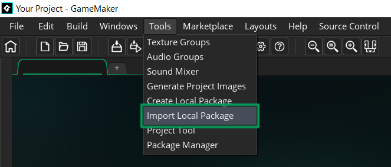
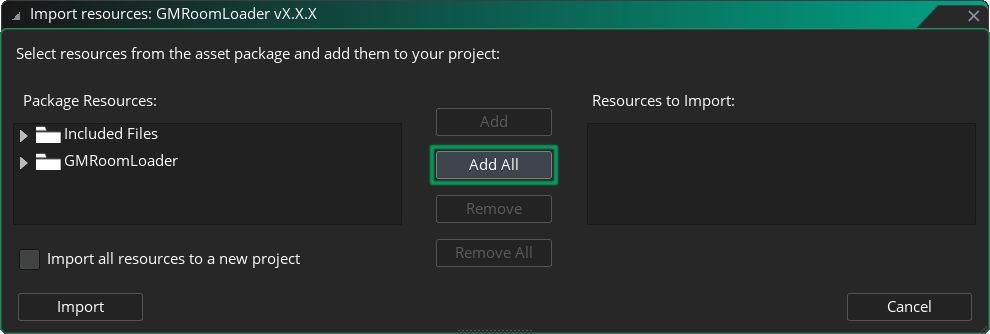
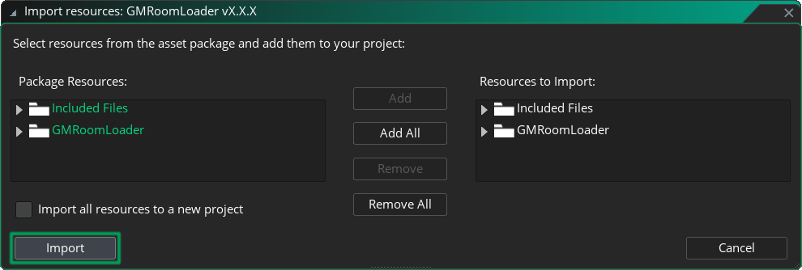

# Getting Started

## Installation
1. Download the latest `.yymps` package from the [Releases](https://github.com/glebtsereteli/GMRoomLoader/releases) page.
2. Import the package into your project.
    * Nagivate to __Tools__ in the top toolbar and click __Import Local Package__, or just drag and drop the file into GameMaker.
    
    * Locate and select the `GMRoomLoader vX.X.X.yymps` local package in Explorer/Finder.
    * Click __Add All__.
    
    * Click __Import__.
    
3. You're good to go! Check out the [Quick Setup](#quick-setup) section below to load your first room!

## Quick Setup
GMRoomLoader offers many tools for handling room data, loading rooms and working with created elements, but the following are the only basics you need to get started!

### 1. Initialize
[Initialize](/pages/api/roomloader/#initialization) the data for the room you'd like to load *at the start of the game*.
```js
RoomLoader.DataInit(rmExample);
```
### 2. Load
[Load](/pages/api/roomloader/#load) the room and store the returned instance of [ReturnData](/pages/api/returndata) in a variable to clean up later.
```js
roomData = RoomLoader.Load(rmExample, 0, 0);
```
### 3. Clean Up
[Clean Up](/pages/api/returndata/#cleanup) *(often called "unload" or "destroy")* the loaded room when needed, if necessary.
```js
roomData.Cleanup();
```
## What's Next?
That's it for the basic setup! To dive deeper, check out:
* The [FAQ](/pages/home/faq) page to find answers to common questions.
* The [Demo](/pages/home/demo) page to see GMRoomLoader in action.
* The [API](/pages/api/overview) section to explore all available methods.
* The __Others__ section for [Help & Support](/pages/others/helpSupport), [Upcoming Features](/pages/others/upcomingFeatures) and [Credits](/pages/others/credits).
